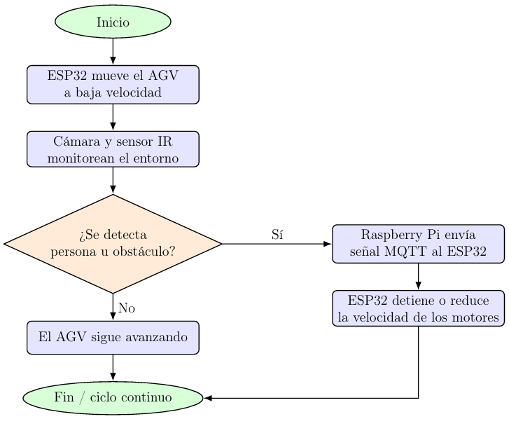
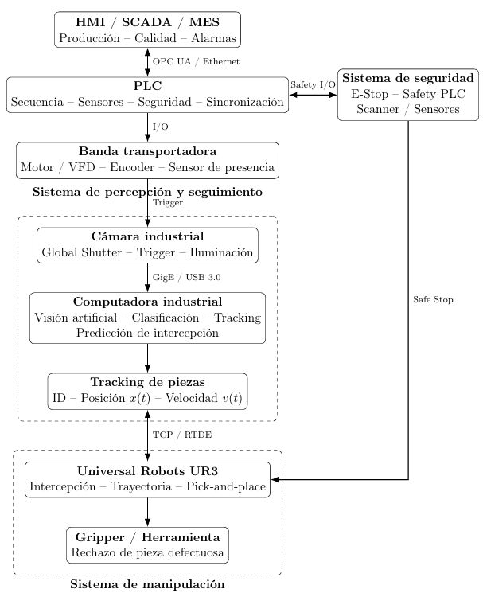
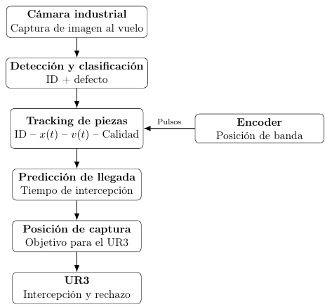
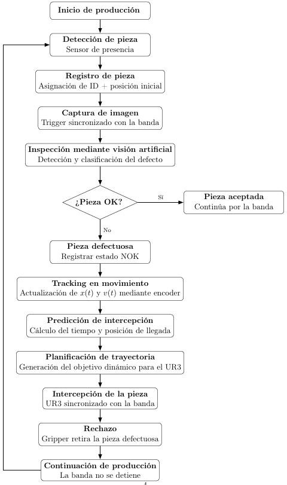

# Práctica 1: Selección de hardware en dos casos de estudio

En esta práctica se analizan dos propuestas de sistemas ciberfísicos y se justifica la selección de hardware para cada una, considerando el problema que resuelven y las restricciones de operación.

---

## Caso 1: AGV para logística de alta carga

### Problema

El sistema debe transportar cargas de hasta 300 kg dentro de pasillos estrechos, por lo que requiere motores de alto torque, desplazamiento a baja velocidad y detección confiable de personas u obstáculos para evitar accidentes.

### Hardware seleccionado y justificación

| Componente | Función | Justificación |
|---|---|---|
| **ESP32** | Control directo de motores (avanzar, detener, reducir velocidad) | Bajo costo, control en tiempo real de actuadores, suficiente para lógica de movimiento sin procesamiento pesado |
| **Raspberry Pi** | Procesamiento de visión (cámara) y sensor infrarrojo | Capacidad de cómputo necesaria para análisis de imagen y detección de personas, tarea que el ESP32 no podría manejar eficientemente |
| **Motores DC de alto torque / motorreductores** | Tracción del AGV | Necesarios para mover 300 kg de carga sin comprometer la seguridad |
| **Driver de motores** | Alimentación y control de motores | Interfaz de potencia entre el ESP32 y los motores |
| **Cámara** | Detección visual de personas | Permite anticipar riesgos antes de que una persona esté demasiado cerca |
| **Sensor infrarrojo (1–2 m)** | Respaldo de detección a corta distancia | Evita frenados tardíos que desplazarían la carga por inercia |
| **MQTT** | Comunicación Raspberry Pi ↔ ESP32 | Protocolo ligero adecuado para enviar señales de detención/reducción de velocidad en tiempo real |

### Arquitectura del sistema

*Figura 1. Arquitectura básica propuesta para el AGV: la Raspberry Pi procesa cámara y sensor infrarrojo, y comunica por MQTT al ESP32, que controla los motores mediante un driver.*

### Diagrama de funcionamiento

*Figura 2. Flujo de operación: el ESP32 mueve el AGV a baja velocidad mientras la cámara y el sensor IR monitorean el entorno; si se detecta una persona u obstáculo, la Raspberry Pi envía la señal de frenado por MQTT.*

### Conclusión del caso

La división de responsabilidades entre el ESP32 (control de motores en tiempo real) y la Raspberry Pi (procesamiento de visión) permite un sistema económico pero seguro, donde el respaldo del sensor infrarrojo compensa la latencia que podría tener el procesamiento de imagen.

---

## Caso 2: Celda ciberfísica de manufactura con UR3 e inspección óptica en línea

### Problema

Una celda automatizada debe ensamblar piezas que llegan a alta velocidad por banda transportadora, usando un brazo colaborativo UR3. Una cámara de visión artificial inspecciona la calidad al vuelo; si detecta un defecto, el UR3 debe descartar la pieza sin detener la línea.

### Hardware seleccionado y justificación

| Componente | Función | Justificación |
|---|---|---|
| **PLC** | Controlador maestro de la celda | Gestiona arranque/parada, estado de banda, sensores, encoder, seguridad y comunicación con UR3 y HMI/SCADA — pero **no** procesa imágenes |
| **Cámara industrial (Global Shutter)** | Captura de imagen al vuelo | El obturador global evita distorsión en piezas en movimiento a alta velocidad |
| **Computadora industrial** | Visión artificial, clasificación y tracking | Requiere mayor capacidad de cómputo que el PLC para procesar imágenes y predecir intercepción |
| **Encoder** | Posición de la banda | Permite calcular x(t) y v(t) de cada pieza para predicción de intercepción |
| **Universal Robots UR3** | Intercepción y retiro de piezas defectuosas | Robot colaborativo capaz de calcular trayectoria y configuración articular en tiempo real vía TCP/RTDE |
| **Gripper / herramienta** | Rechazo físico de la pieza | Ejecuta la remoción sin detener la banda |
| **Safety PLC + E-Stop + scanner** | Seguridad de la celda | Sistema independiente de seguridad (Safe Stop) separado del control de producción |
| **OPC UA / Ethernet** | Comunicación PLC ↔ HMI/SCADA/MES | Estándar industrial para supervisión, historiales y alarmas |

Un punto clave de la arquitectura: el UR3 **no decide** si una pieza se rechaza — solo ejecuta la intercepción; esa decisión es responsabilidad exclusiva del sistema de visión.

### Arquitectura propuesta

*Figura 1. Arquitectura propuesta: HMI/SCADA/MES para supervisión, PLC como controlador maestro, banda transportadora con motor/VFD y encoder, cámara industrial con computadora de visión artificial, UR3 para intercepción, y sistema de seguridad independiente.*

### Sistema de detección y seguimiento predictivo

*Figura 2. La cámara detecta y clasifica cada pieza; el encoder aporta la posición de la banda; con ambos datos se predice el punto de intercepción y se genera el objetivo dinámico para el UR3.*

### Secuencia completa

*Diagrama de flujo: desde la detección de pieza hasta el rechazo dinámico, sin detener la producción en ningún punto.*

### Conclusión del caso

La separación entre el PLC (control determinístico y seguridad) y la computadora industrial (visión y cálculo de trayectoria) permite que la celda opere a alta velocidad sin sacrificar seguridad ni capacidad de procesamiento, mientras el UR3 actúa únicamente como ejecutor de las decisiones del sistema de visión.

---

## Conclusión general

Ambos casos comparten un principio de diseño: separar el control de tiempo real / seguridad (ESP32 y PLC, respectivamente) del procesamiento pesado (Raspberry Pi y computadora industrial). Esta división permite que cada componente se dedique a lo que mejor sabe hacer, optimizando costo, velocidad de respuesta y seguridad del sistema.
