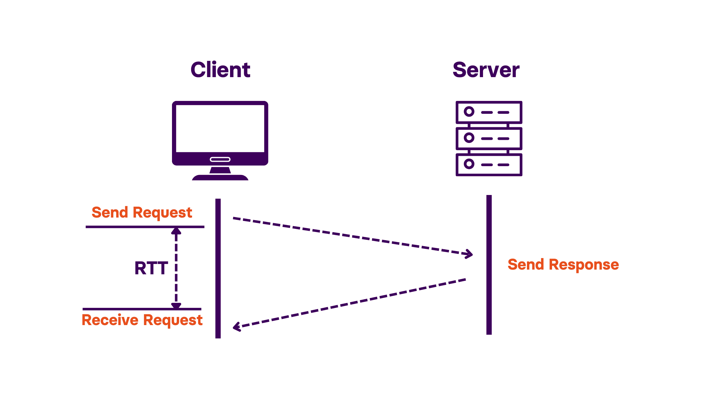

# Práctica 2: Medición y Comparación de Latencia en Redes Inalámbricas (Wi-Fi vs. Bluetooth)

**Autores:** Diego Márquez Esqueda, Andrick Millán Bernal, Marco Alfonso Rodríguez Calixto

---

## Resumen

En este reporte se presenta la implementación de un esquema de comunicación Eco (Ping-Pong) entre dos ESP32 para medir y comparar el RTT de Wi-Fi (SoftAP + UDP) y Bluetooth (Classic SPP), recolectando 100 muestras por escenario variando distancia (1 m y 10 m) y presencia de un obstáculo (puerta).

## Objetivos

El objetivo general es evaluar y comparar el tiempo de latencia (*Round Trip Time* - RTT) en la transmisión de datos punto a punto utilizando los protocolos inalámbricos Wi-Fi y Bluetooth, en el contexto de un Sistema Ciberfísico. Los objetivos específicos son:

- Implementar un esquema de comunicación Eco (*Ping-Pong*) sobre Wi-Fi, utilizando una red punto a punto (SoftAP) y el protocolo UDP.
- Implementar un esquema de comunicación Eco (*Ping-Pong*) sobre Bluetooth Classic mediante el perfil SPP (*Serial Port Profile*).
- Medir el tiempo transcurrido desde el envío de un paquete de datos desde el nodo emisor hasta la recepción del eco devuelto por el nodo receptor, para ambos protocolos.
- Analizar la variación de la latencia en función de variables del entorno, específicamente la distancia entre los nodos y la presencia de obstáculos físicos.
- Comparar el desempeño de Wi-Fi y Bluetooth en términos de latencia promedio, variabilidad (*jitter*) y porcentaje de paquetes perdidos, para determinar su idoneidad en aplicaciones ciberfísicas con requisitos de tiempo real.

---

## Marco teórico

### Network Jitter

El jitter de red, también conocido como *packet delay variation* (PDV), es un efecto tipo tartamudeo en la calidad de la señal debido a *packet delays* inconsistentes en una transmisión de datos. Cada paquete en la transmisión puede ser enrutado de forma diferente hacia su destino, lo que provoca que los paquetes lleguen fuera de orden o que no lleguen en absoluto (lo que se conoce como *packet loss*). Al igual que la latencia, el jitter se mide en milisegundos [2].

Aunque la tecnología puede gestionar esta situación y reordenar los paquetes, esto genera retrasos. Para ilustrar el impacto, en casos de alto jitter durante videollamadas o VoIP, los usuarios experimentarán video entrecortado, voz intermitente o llamadas caídas al hablar con otras personas a través de internet [2].

La latencia de red (también conocida como *lag*) es la duración de tiempo que le toma a un paquete de datos viajar desde su origen hasta su destino a través de una red. Estrechamente relacionado con la latencia, el jitter es una medición de la variación del retraso en una transmisión de datos, característica de las redes de conmutación de paquetes [2].

### Round-Trip Time

El Round-Trip Time (RTT) es el tiempo total que tarda un paquete de datos en viajar desde el emisor al receptor y viceversa. Mide cuánto tiempo se tarda en enviar una solicitud y recibir una respuesta a través de una red [1].



*Figura 1. Esquema de interpretación del RTT [1].*

El RTT se expresa en milisegundos y es un indicador fundamental de latencia de red. Un RTT más bajo significa una comunicación más rápida entre los puntos finales, mientras que un RTT más alto suele indicar retrasos causados por la distancia, la congestión o un enrutamiento ineficiente [1].

El RTT se calcula midiendo el tiempo transcurrido entre el envío de una solicitud y la recepción de una respuesta desde el destino. La forma más común de hacer esto es mediante el comando `ping`, el cual envía un pequeño paquete de datos a un servidor remoto y espera la respuesta [1].

La fórmula básica es:

$$
RTT = T_{\text{response received}} - T_{\text{request sent}}
$$

---

## Procedimiento

### Verificación del hardware

Antes de iniciar la implementación de los esquemas de comunicación, se verificó el correcto funcionamiento de las dos placas ESP32 mediante la carga de un programa de prueba (*Blink*) utilizando el LED integrado de cada placa. Esto permitió confirmar que ambos microcontroladores podían ser programados correctamente desde el Arduino IDE a través de USB, sin requerir ninguna conexión adicional por pines, ya que la práctica no involucra sensores ni actuadores externos.

### Configuración del entorno de red

Se definieron los roles de los dos nodos del sistema: el **Nodo A**, configurado como cliente/maestro, encargado de iniciar la comunicación y medir el tiempo de latencia; y el **Nodo B**, configurado como servidor/esclavo, encargado de reenviar (hacer eco de) los paquetes recibidos de forma inmediata.

Para la comunicación Wi-Fi, el Nodo B se configuró en modo punto de acceso (*SoftAP*), creando su propia red inalámbrica local sin depender de un router externo. El Nodo A se configuró como estación, conectándose directamente a la red generada por el Nodo B. Este enfoque permitió aislar el enlace de posibles interferencias de redes externas y controlar mejor las condiciones del experimento.

### Implementación del esquema Eco (Ping-Pong) en Wi-Fi

El esquema de comunicación se implementó sobre el protocolo UDP, dado su menor overhead respecto a TCP, lo cual resulta más adecuado para una medición de latencia sin la interferencia de mecanismos de retransmisión o control de flujo adicionales.

En el Nodo A, previo al envío de cada paquete, se registró una marca de tiempo en microsegundos utilizando la función `micros()`:

$$
T_{inicio} = \texttt{micros()}
$$

El Nodo B, al recibir un paquete UDP, lo reenvía de inmediato al remitente sin ningún procesamiento adicional, actuando como un servidor de eco puro. Al recibir la respuesta, el Nodo A registra una segunda marca de tiempo y calcula el tiempo de ida y vuelta (RTT) como:

$$
RTT_{WiFi} = T_{fin} - T_{inicio}
$$

Adicionalmente, se calculó la latencia unidireccional estimada como:

$$
Latencia_{unidireccional} \approx \frac{RTT}{2}
$$

El detalle de la implementación en firmware para ambos nodos se encuentra documentado en la sección de [Apéndice](#apéndice).

### Medición de latencia en Wi-Fi

Para cada escenario de prueba, el Nodo A envió 100 paquetes consecutivos, cada uno identificado con un número de secuencia, con un intervalo de 100 ms entre envíos. Para cada paquete se definió un tiempo máximo de espera (*timeout*) de 500 ms; si no se recibía el eco correspondiente dentro de ese intervalo, el paquete se marcaba como perdido y se continuaba con el siguiente envío. Los valores de RTT obtenidos, junto con el estado de cada paquete (recibido o perdido), se transmitieron por el puerto serie del Nodo A en formato de texto separado por comas, para su posterior captura y análisis.

### Implementación del esquema Eco (Ping-Pong) en Bluetooth

Para la comunicación Bluetooth se utilizó el perfil Bluetooth Classic SPP (*Serial Port Profile*), el cual permite establecer un canal de comunicación serie virtual entre los dos nodos. El Nodo B se configuró como esclavo, anunciándose mediante un nombre identificable y ejecutando la misma lógica de eco descrita para Wi-Fi (reenvío inmediato de los datos recibidos).

El Nodo A se configuró como maestro. Inicialmente se intentó establecer la conexión mediante el nombre del dispositivo remoto; sin embargo, dado que este método requiere un proceso de descubrimiento (*inquiry*) por aire que resultó lento y poco confiable, se optó por establecer la conexión directamente mediante la dirección MAC Bluetooth del Nodo B, obtenida previamente a través del puerto serie de dicho nodo. Esta modificación mejoró considerablemente la estabilidad y velocidad del proceso de conexión.

Una vez establecido el enlace, se aplicó el mismo esquema de medición de RTT, sustituyendo el canal de transporte UDP por el canal Bluetooth SPP. El detalle de la implementación en firmware para ambos nodos se encuentra documentado en la sección de [Apéndice](#apéndice).

### Medición de latencia en Bluetooth

Se repitió el mismo procedimiento de medición descrito para Wi-Fi (100 paquetes, intervalo de 100 ms, *timeout* de 500 ms), utilizando el mismo formato de carga útil (*payload*) empleado en las pruebas de Wi-Fi, con el fin de mantener condiciones comparables entre ambos protocolos.

### Pruebas bajo variables de entorno

Con el fin de analizar el efecto de la distancia y de los obstáculos físicos sobre la latencia, las mediciones se repitieron bajo los siguientes escenarios, manteniendo fija la ubicación de cada nodo durante cada corrida completa de 100 paquetes:

- **Escenario 1:** nodos separados a 1 metro, en línea de vista directa, en un entorno interior.
- **Escenario 2:** nodos separados entre 5 y 10 metros, en línea de vista directa, en un entorno exterior.
- **Escenario 3:** nodos separados a 1 metro, con una puerta interpuesta entre ambos como obstáculo físico.

Como prueba adicional, se realizó también una medición a 1 metro en el mismo entorno exterior utilizado en el Escenario 2, con el objetivo de distinguir el efecto de la distancia del efecto del entorno (interior/exterior) sobre la latencia.

### Captura y procesamiento de datos

Para cada corrida de 100 paquetes, la salida del puerto serie del Nodo A fue capturada mediante un script desarrollado en Python, el cual almacenó cada muestra (número de paquete, RTT en milisegundos y estado) en un archivo CSV independiente por escenario y protocolo. A partir de estos datos, el mismo script calculó de forma automática las siguientes métricas para cada conjunto de muestras: latencia mínima, latencia máxima, latencia promedio, desviación estándar (como medida de *jitter*) y porcentaje de paquetes perdidos. El detalle de la implementación de este script se encuentra documentado en la sección de [Apéndice](#apéndice).

---

## Resultados

### Tabla comparativa general

En la Tabla 1 se presentan las métricas de latencia obtenidas para Wi-Fi y Bluetooth a 1 y 10 metros, calculadas a partir de 100 muestras por protocolo y distancia. Las mediciones a 1 metro se realizaron en un entorno interior, mientras que las mediciones a 10 metros se realizaron en un entorno exterior, debido a que el espacio disponible dentro del recinto no permitía dicha separación; esta diferencia de entorno se considera en el análisis de la conclusión.

| Métrica | Wi-Fi (1 m) | Wi-Fi (10 m) | Bluetooth (1 m) | Bluetooth (10 m) |
|---|---|---|---|---|
| Latencia mínima (ms) | 0.617 | 3.710 | 11.677 | 13.633 |
| Latencia máxima (ms) | 19.265 | 70.217 | 98.194 | 59.826 |
| Latencia promedio (ms) | 3.931 | 11.092 | 41.069 | 37.343 |
| Desviación estándar (ms) | 4.532 | 11.751 | 14.853 | 7.095 |
| % Paquetes perdidos | 1.0% | 0.0% | 0.0% | 0.0% |

*Tabla 1. Comparación de métricas de latencia entre Wi-Fi y Bluetooth a 1 m y 10 m.*

### Efecto del entorno en Wi-Fi a 1 metro (interior vs. exterior)

Con el fin de distinguir el efecto de la distancia del efecto del entorno, se realizó una medición adicional de Wi-Fi a 1 metro en el mismo entorno exterior utilizado para la prueba de 10 metros.

| Métrica | Wi-Fi 1 m interior | Wi-Fi 1 m exterior |
|---|---|---|
| Latencia mínima (ms) | 0.617 | 3.498 |
| Latencia máxima (ms) | 19.265 | 50.094 |
| Latencia promedio (ms) | 3.931 | 7.535 |
| Desviación estándar (ms) | 4.532 | 6.157 |
| % Paquetes perdidos | 1.0% | 0.0% |

*Tabla 2. Comparación de latencia Wi-Fi a 1 m entre entorno interior y exterior.*

### Efecto de un obstáculo (puerta) a 1 metro

Se evaluó el efecto de interponer una puerta entre los nodos, manteniendo la distancia fija en 1 metro dentro del mismo entorno interior utilizado como referencia.

| Métrica | Wi-Fi sin obstáculo | Wi-Fi con puerta | Bluetooth sin obstáculo | Bluetooth con puerta |
|---|---|---|---|---|
| Latencia mínima (ms) | 0.617 | 3.412 | 11.677 | 33.527 |
| Latencia máxima (ms) | 19.265 | 16.180 | 98.194 | 89.289 |
| Latencia promedio (ms) | 3.931 | 5.489 | 41.069 | 40.842 |
| Desviación estándar (ms) | 4.532 | 2.436 | 14.853 | 10.525 |
| % Paquetes perdidos | 1.0% | 0.0% | 0.0% | 0.0% |

*Tabla 3. Efecto de un obstáculo (puerta) sobre la latencia de Wi-Fi y Bluetooth a 1 m.*

> **Nota:** la captura de datos crudos de donde se calcularon los valores anteriores se encuentra en la sección de [Datos crudos](#datos-crudos), al final del apéndice.

---

## Conclusión

### ¿Cuál protocolo presentó menor jitter?

Al comparar la desviación estándar obtenida en los distintos escenarios, Wi-Fi presentó menor jitter en la mayoría de las condiciones evaluadas: 4.532 ms (1 m interior), 6.157 ms (1 m exterior) y 2.436 ms (1 m con puerta), frente a los 14.853 ms y 10.525 ms de Bluetooth en esos mismos escenarios comparables. En promedio, el jitter de Wi-Fi (aproximadamente 6.2 ms) resultó considerablemente menor que el de Bluetooth (aproximadamente 10.8 ms). Sin embargo, en el escenario de 10 m exterior se observó la excepción: el jitter de Bluetooth (7.095 ms) fue menor que el de Wi-Fi (11.751 ms). Esto es consistente con el comportamiento de cada protocolo: la variabilidad de Wi-Fi aumenta cuando el enlace se degrada por distancia u obstáculos debido a la contención CSMA/CA, mientras que la variabilidad de Bluetooth se mantiene relativamente constante al estar acotada por el intervalo de conexión fijo del protocolo, independientemente de las condiciones del entorno.

### ¿Cómo afectó la distancia/obstáculos al RTT en cada protocolo?

En Wi-Fi, tanto la distancia como el obstáculo tuvieron un efecto claro sobre el RTT: la latencia promedio casi se triplicó al pasar de 1 m a 10 m (de 3.931 ms a 11.092 ms), y aumentó de forma moderada con la puerta interpuesta (de 3.931 ms a 5.489 ms). En Bluetooth, en cambio, el RTT promedio se mantuvo prácticamente constante frente a ambas variables: 41.069 ms a 1 m frente a 37.343 ms a 10 m, y 41.069 ms sin obstáculo frente a 40.842 ms con la puerta. Esta diferencia se explica por la naturaleza de cada protocolo: la latencia de Wi-Fi depende en gran medida de la calidad de la señal y de la contención del canal, factores que se degradan con la distancia y los obstáculos; mientras que la latencia de Bluetooth está determinada principalmente por el intervalo de conexión fijo del enlace SPP, el cual permanece estable mientras la conexión no se pierda por completo.

### Selección de tecnología para un Sistema Ciberfísico crítico

Para un sistema ciberfísico crítico, como el frenado inalámbrico de un robot industrial, la decisión no puede basarse únicamente en la latencia promedio, sino en el comportamiento en el peor caso y en la previsibilidad del sistema. Wi-Fi ofreció una latencia absoluta considerablemente menor (promedios de un solo dígito de milisegundos en la mayoría de los escenarios), lo cual es deseable para minimizar el tiempo de respuesta ante una orden de frenado. No obstante, sus valores máximos aumentaron de forma significativa con la distancia y los obstáculos (de 19.265 ms hasta 70.217 ms), evidenciando que su comportamiento en el peor caso es poco predecible bajo condiciones cambiantes del entorno, algo común en un piso industrial. Bluetooth, por su parte, mostró una latencia absoluta mucho mayor (promedios de 37–41 ms), lo cual podría resultar excesivo para una parada de emergencia, pero se mantuvo notablemente estable frente a variaciones de distancia y obstáculos, ofreciendo un comportamiento acotado y predecible.

Dado que en un sistema de seguridad crítico la previsibilidad del peor caso es generalmente más importante que la velocidad promedio, se seleccionaría **Bluetooth** como la opción más adecuada entre las dos evaluadas, siempre que su latencia absoluta (del orden de 40 ms) sea compatible con los tiempos de reacción requeridos por la aplicación. En caso de que la aplicación exija una latencia absoluta menor a la que Bluetooth puede ofrecer, sería necesario considerar protocolos inalámbricos industriales diseñados específicamente para determinismo en tiempo real (por ejemplo, Wi-Fi con calidad de servicio garantizada o protocolos de la familia 802.15.4), en lugar de depender de una implementación estándar de Wi-Fi o Bluetooth como las evaluadas en esta práctica.

### Conclusión general

En esta práctica se implementó y evaluó exitosamente un esquema de comunicación Eco (Ping-Pong) sobre Wi-Fi (SoftAP + UDP) y sobre Bluetooth Classic (SPP) entre dos nodos ESP32, permitiendo medir y comparar el tiempo de latencia (RTT) bajo distintas condiciones de distancia y presencia de obstáculos. Los resultados evidenciaron un compromiso claro entre ambas tecnologías: Wi-Fi ofrece menor latencia absoluta pero mayor sensibilidad a las condiciones del entorno, mientras que Bluetooth presenta una latencia más alta pero considerablemente más estable y predecible. Este hallazgo confirma lo señalado en el fundamento teórico respecto a los mecanismos que gobiernan la latencia de cada protocolo (contención CSMA/CA en Wi-Fi frente a intervalos de conexión fijos en Bluetooth), y refuerza la importancia de seleccionar la tecnología inalámbrica adecuada según los requisitos específicos de velocidad y determinismo de cada aplicación ciberfísica, particularmente en aquellas con implicaciones de seguridad.

---

## Apéndice

### nodo_A_wifi_cliente_ping

```cpp
/*
 * NODO A - Wi-Fi Cliente + Medición de RTT (Ping-Pong sobre UDP)
 * ------------------------------------------------------------
 * Este ESP32 se conecta a la red creada por el Nodo B (SoftAP),
 * envía 100 paquetes "PING,<numero>" y mide cuánto tarda en recibir
 * el eco de vuelta. Imprime los resultados en formato CSV por el
 * puerto Serie para que los captures con analizar_latencia.py.
 *
 * IMPORTANTE: el Nodo B debe estar ya encendido y corriendo su
 * sketch de SoftAP antes de arrancar este.
 */

#include <WiFi.h>
#include <WiFiUdp.h>

const char* ssid     = "ESP32_PingPong";
const char* password = "12345678";

IPAddress serverIP(192, 168, 4, 1);   // IP fija del SoftAP del Nodo B
const unsigned int serverPort = 4210;

WiFiUDP udp;
char buffer[256];

const int NUM_PAQUETES        = 100;
const unsigned long TIMEOUT_MS   = 500;   // tiempo máximo de espera por respuesta
const unsigned long INTERVALO_MS = 100;   // pausa entre envíos consecutivos

void setup() {
  Serial.begin(115200);
  delay(500);

  Serial.print("Conectando a ");
  Serial.println(ssid);
  WiFi.begin(ssid, password);
  while (WiFi.status() != WL_CONNECTED) {
    delay(300);
    Serial.print(".");
  }
  Serial.println();
  Serial.print("Conectado. IP local: ");
  Serial.println(WiFi.localIP());

  udp.begin(0);  // puerto local asignado automáticamente
  delay(1500);

  Serial.println("Iniciando prueba de latencia Wi-Fi...");
  Serial.println("numero,rtt_ms,estado");   // encabezado CSV

  for (int i = 1; i <= NUM_PAQUETES; i++) {
    String msg = "PING," + String(i);
    unsigned long t_inicio = micros();

    udp.beginPacket(serverIP, serverPort);
    udp.print(msg);
    udp.endPacket();

    bool recibido = false;
    unsigned long t_limite = millis() + TIMEOUT_MS;
    while (millis() < t_limite) {
      int packetSize = udp.parsePacket();
      if (packetSize) {
        int len = udp.read(buffer, sizeof(buffer) - 1);
        buffer[len] = 0;
        unsigned long t_fin = micros();
        float rtt_ms = (t_fin - t_inicio) / 1000.0;
        Serial.println(String(i) + "," + String(rtt_ms, 3) + ",OK");
        recibido = true;
        break;
      }
    }

    if (!recibido) {
      Serial.println(String(i) + ",NaN,PERDIDO");
    }

    delay(INTERVALO_MS);
  }

  Serial.println("FIN");
}

void loop() {
  // la prueba corre una sola vez en setup(); reinicia la placa para repetir
}
```

### nodo_B_wifi_softap_echo

```cpp
/*
 * NODO B - Wi-Fi SoftAP + Servidor de Eco (UDP)
 * ------------------------------------------------
 * Este ESP32 crea su propia red Wi-Fi (SoftAP) y escucha paquetes UDP.
 * En cuanto recibe uno, lo reenvía (hace "eco") inmediatamente al Nodo A.
 * No requiere router externo.
 *
 * IMPORTANTE: subir este sketch primero al ESP32 que se usará como Nodo B,
 * y dejarlo encendido antes de arrancar el Nodo A.
 */

#include <WiFi.h>
#include <WiFiUdp.h>

const char* ssid     = "ESP32_PingPong";   // nombre de la red que crea el Nodo B
const char* password = "12345678";         // minimo 8 caracteres

WiFiUDP udp;
const unsigned int localPort = 4210;
char incomingPacket[256];

void setup() {
  Serial.begin(115200);
  delay(500);

  WiFi.softAP(ssid, password);
  Serial.println("=== Nodo B (Wi-Fi SoftAP) ===");
  Serial.print("SSID: ");
  Serial.println(ssid);
  Serial.print("IP del SoftAP: ");
  Serial.println(WiFi.softAPIP());   // normalmente 192.168.4.1

  udp.begin(localPort);
  Serial.print("Escuchando eco UDP en puerto ");
  Serial.println(localPort);
}

void loop() {
  int packetSize = udp.parsePacket();
  if (packetSize) {
    int len = udp.read(incomingPacket, sizeof(incomingPacket) - 1);
    if (len > 0) incomingPacket[len] = 0;

    // Reenvía el mismo paquete de vuelta al remitente (eco)
    udp.beginPacket(udp.remoteIP(), udp.remotePort());
    udp.write((uint8_t*)incomingPacket, len);
    udp.endPacket();
  }
}
```

### nodo_A_bluetooth_ping

```cpp
/*
 * NODO A - Bluetooth Classic (SPP) - Cliente + Medición de RTT
 * ---------------------------------------------------------------
 * Este ESP32 se conecta como "maestro" al Nodo B por Bluetooth,
 * envía 100 mensajes "PING,<numero>" y mide el tiempo hasta recibir
 * el eco de vuelta. Imprime los resultados en formato CSV por el
 * puerto Serie (USB) para capturarlos con analizar_latencia.py.
 *
 * IMPORTANTE: el Nodo B debe estar encendido y corriendo su sketch
 * de eco Bluetooth antes de arrancar este.
 *
 * Conectar por NOMBRE con esta libreria puede ser lento/poco confiable
 * porque implica un descubrimiento (inquiry) por aire. En su lugar,
 * este sketch se conecta directo por la DIRECCION MAC del Nodo B, que
 * es mucho mas rapido y estable.
 */

#include "BluetoothSerial.h"

BluetoothSerial SerialBT;

uint8_t direccionNodoB[6] = {0x38, 0x18, 0x2B, 0x8B, 0x6E, 0xEE};

const int NUM_PAQUETES        = 100;
const unsigned long TIMEOUT_MS   = 500;
const unsigned long INTERVALO_MS = 100;

void setup() {
  Serial.begin(115200);
  delay(500);

  SerialBT.begin("ESP32_NodoA_BT", true);   // true = modo maestro
  Serial.print("Conectando por MAC a Nodo B: ");
  for (int i = 0; i < 6; i++) {
    if (direccionNodoB[i] < 0x10) Serial.print("0");
    Serial.print(direccionNodoB[i], HEX);
    if (i < 5) Serial.print(":");
  }
  Serial.println();

  bool conectado = false;
  int intentos = 0;
  while (!conectado && intentos < 20) {
    conectado = SerialBT.connect(direccionNodoB);
    if (!conectado) {
      Serial.println("Reintentando conexion...");
      delay(1000);
      intentos++;
    }
  }

  if (!conectado) {
    Serial.println("No se pudo conectar por Bluetooth. Revisa que el Nodo B este encendido.");
    while (true) delay(1000);
  }

  Serial.println("Conectado por Bluetooth.");
  delay(1500);

  Serial.println("Iniciando prueba de latencia Bluetooth...");
  Serial.println("numero,rtt_ms,estado");   // encabezado CSV

  for (int i = 1; i <= NUM_PAQUETES; i++) {
    String msg = "PING," + String(i);
    unsigned long t_inicio = micros();
    SerialBT.println(msg);

    bool recibido = false;
    unsigned long t_limite = millis() + TIMEOUT_MS;
    while (millis() < t_limite) {
      if (SerialBT.available()) {
        String resp = SerialBT.readStringUntil('\n');
        unsigned long t_fin = micros();
        float rtt_ms = (t_fin - t_inicio) / 1000.0;
        Serial.println(String(i) + "," + String(rtt_ms, 3) + ",OK");
        recibido = true;
        break;
      }
    }

    if (!recibido) {
      Serial.println(String(i) + ",NaN,PERDIDO");
    }

    delay(INTERVALO_MS);
  }

  Serial.println("FIN");
}

void loop() {
  // la prueba corre una sola vez en setup(); reinicia la placa para repetir
}
```

### nodo_B_bluetooth_echo

```cpp
/*
 * NODO B - Bluetooth Classic (SPP) - Servidor de Eco
 * ---------------------------------------------------
 * Este ESP32 se anuncia por Bluetooth como "ESP32_NodoB_BT".
 * En cuanto recibe una línea de texto, la reenvía (eco) de vuelta.
 *
 * IMPORTANTE: subir este sketch primero al ESP32 que usará como Nodo B,
 * y dejarlo encendido antes de arrancar el Nodo A.
 */

#include "BluetoothSerial.h"
#include "esp_bt_device.h"

#if !defined(CONFIG_BT_SPP_ENABLED)
#error Bluetooth Serial (SPP) no está habilitado. Revisa Tools > Partition Scheme / Board config.
#endif

BluetoothSerial SerialBT;

void setup() {
  Serial.begin(115200);
  SerialBT.begin("ESP32_NodoB_BT");   // nombre visible al conectarse
  Serial.println("=== Nodo B (Bluetooth SPP) ===");

  // Imprime la direccion MAC Bluetooth de este ESP32.
  // Copia este valor: lo necesitas para configurar el Nodo A.
  const uint8_t* mac = esp_bt_dev_get_address();
  char macStr[18];
  sprintf(macStr, "%02X:%02X:%02X:%02X:%02X:%02X",
          mac[0], mac[1], mac[2], mac[3], mac[4], mac[5]);
  Serial.print(">>> Direccion MAC Bluetooth del Nodo B: ");
  Serial.println(macStr);
  Serial.println(">>> Copia esos 6 valores hexadecimales al sketch del Nodo A.");

  Serial.println("Esperando conexion del Nodo A...");
}

void loop() {
  if (SerialBT.available()) {
    String data = SerialBT.readStringUntil('\n');
    SerialBT.println(data);   // eco inmediato
  }
}
```

### analizar_latencia.py

```python
"""
Captura y analiza los resultados de latencia que imprime el Nodo A
(ya sea el sketch de Wi-Fi o el de Bluetooth) por el puerto Serie.

Uso:
    python analizar_latencia.py <puerto_serial> <archivo_salida.csv> [baudios]

Ejemplos:
    python analizar_latencia.py COM5 wifi_1m.csv
    python analizar_latencia.py /dev/ttyUSB0 bt_10m.csv 115200

Flujo recomendado: corre este script UNA vez por cada combinación de
protocolo + escenario (Wi-Fi 1m, Wi-Fi 10m, Wi-Fi obstáculo,
BT 1m, BT 10m, BT obstáculo), reiniciando el Nodo A antes de cada corrida
y guardando cada resultado con un nombre distinto.
"""

import sys
import time
import csv
import statistics

try:
    import serial
except ImportError:
    print("Falta la librería pyserial. Instálala con: pip install pyserial")
    sys.exit(1)


def capturar(puerto, baudios, archivo_salida, duracion_max=90):
    ser = serial.Serial(puerto, baudios, timeout=1)
    time.sleep(2)  # tiempo para que el ESP32 reinicie tras abrir el puerto
    print(f"Escuchando en {puerto} @ {baudios} baudios (Ctrl+C para detener)...")

    capturando = False
    filas = []
    inicio = time.time()

    with open(archivo_salida, "w", newline="") as f:
        writer = csv.writer(f)
        writer.writerow(["numero", "rtt_ms", "estado"])

        while time.time() - inicio < duracion_max:
            try:
                linea = ser.readline().decode("utf-8", errors="ignore").strip()
            except KeyboardInterrupt:
                break
            if not linea:
                continue

            print(linea)

            if linea.startswith("numero,rtt_ms,estado"):
                capturando = True
                continue
            if linea == "FIN":
                break
            if capturando:
                partes = linea.split(",")
                if len(partes) == 3:
                    writer.writerow(partes)
                    filas.append(partes)

    ser.close()
    print(f"\nDatos guardados en: {archivo_salida}")
    return filas


def analizar(archivo_csv):
    rtts = []
    perdidos = 0
    total = 0

    with open(archivo_csv, newline="") as f:
        lector = csv.DictReader(f)
        for fila in lector:
            total += 1
            if fila["estado"] == "OK":
                rtts.append(float(fila["rtt_ms"]))
            else:
                perdidos += 1

    print(f"\n--- Resultados: {archivo_csv} ---")
    print(f"Paquetes enviados:   {total}")
    if total:
        print(f"Paquetes perdidos:   {perdidos} ({perdidos/total*100:.1f}%)")
    if rtts:
        print(f"Latencia mínima:     {min(rtts):.3f} ms")
        print(f"Latencia máxima:     {max(rtts):.3f} ms")
        print(f"Latencia promedio:   {statistics.mean(rtts):.3f} ms")
        if len(rtts) > 1:
            print(f"Desviación estándar: {statistics.stdev(rtts):.3f} ms  (jitter)")
    else:
        print("No se recibió ningún paquete válido (revisa la conexión).")


if __name__ == "__main__":
    if len(sys.argv) < 3:
        print(__doc__)
        sys.exit(1)

    puerto = sys.argv[1]
    archivo = sys.argv[2]
    baudios = int(sys.argv[3]) if len(sys.argv) > 3 else 115200

    capturar(puerto, baudios, archivo)
    analizar(archivo)
```

---

## Datos crudos

<details markdown="block">
<summary>bt_1m.csv (100 muestras) — clic para expandir</summary>

| Número | RTT (ms) | Estado |
|---|---|---|
| 1 | 36.588 | OK |
| 2 | 39.685 | OK |
| 3 | 36.945 | OK |
| 4 | 37.442 | OK |
| 5 | 36.689 | OK |
| 6 | 36.942 | OK |
| 7 | 67.435 | OK |
| 8 | 34.167 | OK |
| 9 | 33.921 | OK |
| 10 | 37.437 | OK |
| 11 | 34.169 | OK |
| 12 | 33.928 | OK |
| 13 | 33.673 | OK |
| 14 | 36.942 | OK |
| 15 | 34.922 | OK |
| 16 | 37.435 | OK |
| 17 | 42.942 | OK |
| 18 | 34.967 | OK |
| 19 | 36.188 | OK |
| 20 | 33.938 | OK |
| 21 | 86.188 | OK |
| 22 | 33.938 | OK |
| 23 | 36.192 | OK |
| 24 | 33.935 | OK |
| 25 | 33.673 | OK |
| 26 | 36.942 | OK |
| 27 | 34.947 | OK |
| 28 | 36.192 | OK |
| 29 | 37.689 | OK |
| 30 | 34.424 | OK |
| 31 | 36.689 | OK |
| 32 | 38.157 | OK |
| 33 | 33.944 | OK |
| 34 | 36.189 | OK |
| 35 | 63.943 | OK |
| 36 | 37.444 | OK |
| 37 | 36.686 | OK |
| 38 | 98.194 | OK |
| 39 | 86.438 | OK |
| 40 | 36.713 | OK |
| 41 | 38.194 | OK |
| 42 | 37.684 | OK |
| 43 | 36.944 | OK |
| 44 | 36.193 | OK |
| 45 | 36.434 | OK |
| 46 | 36.692 | OK |
| 47 | 36.943 | OK |
| 48 | 37.443 | OK |
| 49 | 36.685 | OK |
| 50 | 36.942 | OK |
| 51 | 37.439 | OK |
| 52 | 36.692 | OK |
| 53 | 20.689 | OK |
| 54 | 38.192 | OK |
| 55 | 61.444 | OK |
| 56 | 47.951 | OK |
| 57 | 37.441 | OK |
| 58 | 36.690 | OK |
| 59 | 38.192 | OK |
| 60 | 36.446 | OK |
| 61 | 36.692 | OK |
| 62 | 36.944 | OK |
| 63 | 36.188 | OK |
| 64 | 36.443 | OK |
| 65 | 39.193 | OK |
| 66 | 36.439 | OK |
| 67 | 36.687 | OK |
| 68 | 36.949 | OK |
| 69 | 37.441 | OK |
| 70 | 36.691 | OK |
| 71 | 36.949 | OK |
| 72 | 59.910 | OK |
| 73 | 37.444 | OK |
| 74 | 36.685 | OK |
| 75 | 96.950 | OK |
| 76 | 37.440 | OK |
| 77 | 37.951 | OK |
| 78 | 36.192 | OK |
| 79 | 36.444 | OK |
| 80 | 36.689 | OK |
| 81 | 64.442 | OK |
| 82 | 36.686 | OK |
| 83 | 36.947 | OK |
| 84 | 34.933 | OK |
| 85 | 36.185 | OK |
| 86 | 40.185 | OK |
| 87 | 37.686 | OK |
| 88 | 34.426 | OK |
| 89 | 36.687 | OK |
| 90 | 34.333 | OK |
| 91 | 34.185 | OK |
| 92 | 36.437 | OK |
| 93 | 11.677 | OK |
| 94 | 89.443 | OK |
| 95 | 97.950 | OK |
| 96 | 37.444 | OK |
| 97 | 36.699 | OK |
| 98 | 38.190 | OK |
| 99 | 43.935 | OK |
| 100 | 39.944 | OK |

</details>

<details markdown="block">
<summary>bt_1m_interior_puerta.csv (100 muestras) — clic para expandir</summary>

| Número | RTT (ms) | Estado |
|---|---|---|
| 1 | 36.942 | OK |
| 2 | 37.542 | OK |
| 3 | 61.794 | OK |
| 4 | 37.289 | OK |
| 5 | 36.547 | OK |
| 6 | 35.515 | OK |
| 7 | 51.790 | OK |
| 8 | 37.291 | OK |
| 9 | 36.548 | OK |
| 10 | 39.291 | OK |
| 11 | 41.540 | OK |
| 12 | 39.295 | OK |
| 13 | 36.545 | OK |
| 14 | 61.799 | OK |
| 15 | 37.288 | OK |
| 16 | 65.293 | OK |
| 17 | 37.790 | OK |
| 18 | 37.289 | OK |
| 19 | 36.543 | OK |
| 20 | 36.790 | OK |
| 21 | 37.293 | OK |
| 22 | 36.545 | OK |
| 23 | 36.789 | OK |
| 24 | 37.290 | OK |
| 25 | 82.794 | OK |
| 26 | 39.799 | OK |
| 27 | 38.502 | OK |
| 28 | 36.789 | OK |
| 29 | 37.295 | OK |
| 30 | 59.034 | OK |
| 31 | 33.777 | OK |
| 32 | 33.527 | OK |
| 33 | 35.533 | OK |
| 34 | 34.284 | OK |
| 35 | 39.051 | OK |
| 36 | 62.543 | OK |
| 37 | 36.792 | OK |
| 38 | 37.297 | OK |
| 39 | 69.049 | OK |
| 40 | 37.548 | OK |
| 41 | 36.792 | OK |
| 42 | 37.288 | OK |
| 43 | 36.543 | OK |
| 44 | 40.543 | OK |
| 45 | 34.276 | OK |
| 46 | 34.055 | OK |
| 47 | 33.778 | OK |
| 48 | 61.049 | OK |
| 49 | 35.034 | OK |
| 50 | 36.290 | OK |
| 51 | 34.033 | OK |
| 52 | 36.291 | OK |
| 53 | 51.540 | OK |
| 54 | 34.282 | OK |
| 55 | 61.540 | OK |
| 56 | 35.533 | OK |
| 57 | 89.289 | OK |
| 58 | 34.033 | OK |
| 59 | 36.289 | OK |
| 60 | 35.277 | OK |
| 61 | 37.791 | OK |
| 62 | 34.777 | OK |
| 63 | 36.044 | OK |
| 64 | 35.034 | OK |
| 65 | 36.292 | OK |
| 66 | 36.545 | OK |
| 67 | 35.532 | OK |
| 68 | 36.789 | OK |
| 69 | 37.288 | OK |
| 70 | 36.539 | OK |
| 71 | 38.047 | OK |
| 72 | 37.540 | OK |
| 73 | 36.795 | OK |
| 74 | 37.279 | OK |
| 75 | 36.541 | OK |
| 76 | 39.293 | OK |
| 77 | 36.546 | OK |
| 78 | 36.796 | OK |
| 79 | 37.293 | OK |
| 80 | 36.546 | OK |
| 81 | 36.795 | OK |
| 82 | 37.288 | OK |
| 83 | 37.791 | OK |
| 84 | 37.288 | OK |
| 85 | 36.541 | OK |
| 86 | 61.794 | OK |
| 87 | 37.294 | OK |
| 88 | 37.798 | OK |
| 89 | 37.290 | OK |
| 90 | 46.549 | OK |
| 91 | 36.797 | OK |
| 92 | 36.048 | OK |
| 93 | 40.051 | OK |
| 94 | 37.545 | OK |
| 95 | 65.580 | OK |
| 96 | 36.794 | OK |
| 97 | 34.773 | OK |
| 98 | 36.051 | OK |
| 99 | 46.291 | OK |
| 100 | 36.540 | OK |

</details>

<details markdown="block">
<summary>bt_10m.csv (100 muestras) — clic para expandir</summary>

| Número | RTT (ms) | Estado |
|---|---|---|
| 1 | 38.236 | OK |
| 2 | 37.830 | OK |
| 3 | 34.809 | OK |
| 4 | 13.633 | OK |
| 5 | 34.303 | OK |
| 6 | 36.583 | OK |
| 7 | 58.093 | OK |
| 8 | 38.834 | OK |
| 9 | 36.090 | OK |
| 10 | 36.338 | OK |
| 11 | 35.319 | OK |
| 12 | 50.314 | OK |
| 13 | 34.072 | OK |
| 14 | 36.336 | OK |
| 15 | 34.073 | OK |
| 16 | 35.079 | OK |
| 17 | 33.811 | OK |
| 18 | 37.333 | OK |
| 19 | 34.085 | OK |
| 20 | 36.327 | OK |
| 21 | 34.075 | OK |
| 22 | 38.823 | OK |
| 23 | 33.567 | OK |
| 24 | 35.577 | OK |
| 25 | 34.325 | OK |
| 26 | 46.478 | OK |
| 27 | 36.837 | OK |
| 28 | 34.832 | OK |
| 29 | 33.576 | OK |
| 30 | 36.822 | OK |
| 31 | 47.335 | OK |
| 32 | 35.330 | OK |
| 33 | 34.090 | OK |
| 34 | 33.828 | OK |
| 35 | 34.833 | OK |
| 36 | 34.821 | OK |
| 37 | 33.582 | OK |
| 38 | 34.330 | OK |
| 39 | 34.081 | OK |
| 40 | 33.820 | OK |
| 41 | 59.826 | OK |
| 42 | 34.823 | OK |
| 43 | 33.569 | OK |
| 44 | 34.342 | OK |
| 45 | 49.230 | OK |
| 46 | 35.092 | OK |
| 47 | 33.823 | OK |
| 48 | 33.579 | OK |
| 49 | 36.822 | OK |
| 50 | 42.330 | OK |
| 51 | 34.080 | OK |
| 52 | 33.824 | OK |
| 53 | 58.575 | OK |
| 54 | 36.825 | OK |
| 55 | 34.825 | OK |
| 56 | 33.569 | OK |
| 57 | 34.334 | OK |
| 58 | 59.083 | OK |
| 59 | 33.834 | OK |
| 60 | 39.820 | OK |
| 61 | 58.569 | OK |
| 62 | 34.328 | OK |
| 63 | 34.089 | OK |
| 64 | 33.824 | OK |
| 65 | 34.826 | OK |
| 66 | 33.568 | OK |
| 67 | 34.328 | OK |
| 68 | 35.325 | OK |
| 69 | 39.090 | OK |
| 70 | 33.819 | OK |
| 71 | 34.822 | OK |
| 72 | 33.569 | OK |
| 73 | 47.994 | OK |
| 74 | 35.108 | OK |
| 75 | 33.824 | OK |
| 76 | 33.573 | OK |
| 77 | 34.334 | OK |
| 78 | 35.326 | OK |
| 79 | 34.088 | OK |
| 80 | 35.087 | OK |
| 81 | 35.088 | OK |
| 82 | 33.823 | OK |
| 83 | 38.572 | OK |
| 84 | 34.330 | OK |
| 85 | 34.078 | OK |
| 86 | 36.329 | OK |
| 87 | 34.080 | OK |
| 88 | 58.826 | OK |
| 89 | 34.823 | OK |
| 90 | 33.583 | OK |
| 91 | 34.330 | OK |
| 92 | 54.090 | OK |
| 93 | 37.589 | OK |
| 94 | 36.836 | OK |
| 95 | 33.577 | OK |
| 96 | 34.327 | OK |
| 97 | 34.090 | OK |
| 98 | 47.582 | OK |
| 99 | 36.836 | OK |
| 100 | 37.334 | OK |

</details>

<details markdown="block">
<summary>wifi_1m.csv (100 muestras) — clic para expandir</summary>

| Número | RTT (ms) | Estado |
|---|---|---|
| 1 | 17.987 | OK |
| 2 | 4.748 | OK |
| 3 | 5.198 | OK |
| 4 | 4.617 | OK |
| 5 | 5.580 | OK |
| 6 | 5.007 | OK |
| 7 | 6.099 | OK |
| 8 | 3.970 | OK |
| 9 | 3.826 | OK |
| 10 | 5.179 | OK |
| 11 | 19.265 | OK |
| 12 | 5.970 | OK |
| 13 | 11.029 | OK |
| 14 | 3.992 | OK |
| 15 | 3.963 | OK |
| 16 | 8.030 | OK |
| 17 | 5.594 | OK |
| 18 | 4.342 | OK |
| 19 | 4.004 | OK |
| 20 | 4.532 | OK |
| 21 | 4.030 | OK |
| 22 | 5.020 | OK |
| 23 | 3.947 | OK |
| 24 | 15.141 | OK |
| 25 | 5.554 | OK |
| 26 | 3.948 | OK |
| 27 | 4.197 | OK |
| 28 | 7.098 | OK |
| 29 | 8.329 | OK |
| 30 | 6.328 | OK |
| 31 | 5.416 | OK |
| 32 | 5.559 | OK |
| 33 | 10.137 | OK |
| 34 | 5.988 | OK |
| 35 | 5.027 | OK |
| 36 | 13.204 | OK |
| 37 | 12.789 | OK |
| 38 | 14.994 | OK |
| 39 | 11.072 | OK |
| 40 | 6.206 | OK |
| 41 | 17.117 | OK |
| 42 | 4.004 | OK |
| 43 | 13.401 | OK |
| 44 | 4.934 | OK |
| 45 | 6.859 | OK |
| 46 | 5.881 | OK |
| 47 | 4.055 | OK |
| 48 | NaN | PERDIDO |
| 49 | 14.043 | OK |
| 50 | 0.623 | OK |
| 51 | 0.634 | OK |
| 52 | 0.621 | OK |
| 53 | 0.636 | OK |
| 54 | 0.627 | OK |
| 55 | 0.634 | OK |
| 56 | 0.629 | OK |
| 57 | 0.624 | OK |
| 58 | 0.618 | OK |
| 59 | 0.626 | OK |
| 60 | 0.623 | OK |
| 61 | 0.626 | OK |
| 62 | 0.621 | OK |
| 63 | 0.627 | OK |
| 64 | 0.617 | OK |
| 65 | 0.630 | OK |
| 66 | 0.620 | OK |
| 67 | 0.625 | OK |
| 68 | 0.617 | OK |
| 69 | 0.626 | OK |
| 70 | 0.617 | OK |
| 71 | 0.626 | OK |
| 72 | 0.618 | OK |
| 73 | 0.626 | OK |
| 74 | 0.617 | OK |
| 75 | 0.626 | OK |
| 76 | 0.617 | OK |
| 77 | 0.655 | OK |
| 78 | 0.629 | OK |
| 79 | 0.661 | OK |
| 80 | 0.621 | OK |
| 81 | 0.630 | OK |
| 82 | 0.623 | OK |
| 83 | 0.632 | OK |
| 84 | 0.629 | OK |
| 85 | 0.630 | OK |
| 86 | 0.625 | OK |
| 87 | 0.631 | OK |
| 88 | 0.630 | OK |
| 89 | 0.630 | OK |
| 90 | 0.630 | OK |
| 91 | 0.633 | OK |
| 92 | 0.625 | OK |
| 93 | 0.634 | OK |
| 94 | 0.629 | OK |
| 95 | 0.631 | OK |
| 96 | 0.628 | OK |
| 97 | 0.630 | OK |
| 98 | 0.629 | OK |
| 99 | 0.631 | OK |
| 100 | 0.629 | OK |

</details>

<details markdown="block">
<summary>wifi_1m_exterior.csv (100 muestras) — clic para expandir</summary>

| Número | RTT (ms) | Estado |
|---|---|---|
| 1 | 12.188 | OK |
| 2 | 7.505 | OK |
| 3 | 6.406 | OK |
| 4 | 5.978 | OK |
| 5 | 11.184 | OK |
| 6 | 31.122 | OK |
| 7 | 15.337 | OK |
| 8 | 6.734 | OK |
| 9 | 13.112 | OK |
| 10 | 6.835 | OK |
| 11 | 7.869 | OK |
| 12 | 6.295 | OK |
| 13 | 8.557 | OK |
| 14 | 3.916 | OK |
| 15 | 3.906 | OK |
| 16 | 3.892 | OK |
| 17 | 3.918 | OK |
| 18 | 4.548 | OK |
| 19 | 4.962 | OK |
| 20 | 10.269 | OK |
| 21 | 8.839 | OK |
| 22 | 6.897 | OK |
| 23 | 20.694 | OK |
| 24 | 3.936 | OK |
| 25 | 3.854 | OK |
| 26 | 10.502 | OK |
| 27 | 50.094 | OK |
| 28 | 4.897 | OK |
| 29 | 7.340 | OK |
| 30 | 4.195 | OK |
| 31 | 5.327 | OK |
| 32 | 5.651 | OK |
| 33 | 11.286 | OK |
| 34 | 8.960 | OK |
| 35 | 4.427 | OK |
| 36 | 6.260 | OK |
| 37 | 14.330 | OK |
| 38 | 21.568 | OK |
| 39 | 9.325 | OK |
| 40 | 9.078 | OK |
| 41 | 10.583 | OK |
| 42 | 6.232 | OK |
| 43 | 9.991 | OK |
| 44 | 4.813 | OK |
| 45 | 3.983 | OK |
| 46 | 7.452 | OK |
| 47 | 6.071 | OK |
| 48 | 6.218 | OK |
| 49 | 4.881 | OK |
| 50 | 3.892 | OK |
| 51 | 5.468 | OK |
| 52 | 5.781 | OK |
| 53 | 5.535 | OK |
| 54 | 5.291 | OK |
| 55 | 6.788 | OK |
| 56 | 4.497 | OK |
| 57 | 7.482 | OK |
| 58 | 10.227 | OK |
| 59 | 3.853 | OK |
| 60 | 11.321 | OK |
| 61 | 12.038 | OK |
| 62 | 3.866 | OK |
| 63 | 12.330 | OK |
| 64 | 9.038 | OK |
| 65 | 3.498 | OK |
| 66 | 4.118 | OK |
| 67 | 3.930 | OK |
| 68 | 3.542 | OK |
| 69 | 4.203 | OK |
| 70 | 4.029 | OK |
| 71 | 6.605 | OK |
| 72 | 4.161 | OK |
| 73 | 4.542 | OK |
| 74 | 4.275 | OK |
| 75 | 4.191 | OK |
| 76 | 3.948 | OK |
| 77 | 3.831 | OK |
| 78 | 4.002 | OK |
| 79 | 3.960 | OK |
| 80 | 3.949 | OK |
| 81 | 5.040 | OK |
| 82 | 5.269 | OK |
| 83 | 6.357 | OK |
| 84 | 10.163 | OK |
| 85 | 3.723 | OK |
| 86 | 3.758 | OK |
| 87 | 3.810 | OK |
| 88 | 3.915 | OK |
| 89 | 3.924 | OK |
| 90 | 3.902 | OK |
| 91 | 4.014 | OK |
| 92 | 18.147 | OK |
| 93 | 12.118 | OK |
| 94 | 9.886 | OK |
| 95 | 4.654 | OK |
| 96 | 4.628 | OK |
| 97 | 4.651 | OK |
| 98 | 3.952 | OK |
| 99 | 8.426 | OK |
| 100 | 6.779 | OK |

</details>

<details markdown="block">
<summary>wifi_1m_interior_puerta.csv (100 muestras) — clic para expandir</summary>

| Número | RTT (ms) | Estado |
|---|---|---|
| 1 | 10.747 | OK |
| 2 | 5.774 | OK |
| 3 | 3.950 | OK |
| 4 | 4.009 | OK |
| 5 | 5.165 | OK |
| 6 | 4.079 | OK |
| 7 | 3.906 | OK |
| 8 | 4.125 | OK |
| 9 | 5.264 | OK |
| 10 | 5.279 | OK |
| 11 | 5.613 | OK |
| 12 | 3.412 | OK |
| 13 | 3.939 | OK |
| 14 | 3.982 | OK |
| 15 | 5.575 | OK |
| 16 | 7.837 | OK |
| 17 | 5.569 | OK |
| 18 | 3.793 | OK |
| 19 | 3.850 | OK |
| 20 | 4.087 | OK |
| 21 | 3.840 | OK |
| 22 | 3.870 | OK |
| 23 | 3.942 | OK |
| 24 | 5.271 | OK |
| 25 | 5.468 | OK |
| 26 | 3.834 | OK |
| 27 | 5.314 | OK |
| 28 | 5.591 | OK |
| 29 | 3.944 | OK |
| 30 | 5.324 | OK |
| 31 | 5.746 | OK |
| 32 | 5.733 | OK |
| 33 | 4.034 | OK |
| 34 | 10.808 | OK |
| 35 | 4.053 | OK |
| 36 | 5.192 | OK |
| 37 | 11.913 | OK |
| 38 | 14.413 | OK |
| 39 | 4.118 | OK |
| 40 | 5.574 | OK |
| 41 | 5.648 | OK |
| 42 | 4.167 | OK |
| 43 | 7.201 | OK |
| 44 | 3.908 | OK |
| 45 | 4.991 | OK |
| 46 | 3.707 | OK |
| 47 | 5.525 | OK |
| 48 | 3.902 | OK |
| 49 | 3.954 | OK |
| 50 | 6.987 | OK |
| 51 | 3.956 | OK |
| 52 | 7.072 | OK |
| 53 | 6.732 | OK |
| 54 | 8.785 | OK |
| 55 | 10.282 | OK |
| 56 | 13.625 | OK |
| 57 | 5.245 | OK |
| 58 | 5.574 | OK |
| 59 | 3.905 | OK |
| 60 | 7.478 | OK |
| 61 | 5.228 | OK |
| 62 | 5.375 | OK |
| 63 | 12.504 | OK |
| 64 | 5.094 | OK |
| 65 | 3.868 | OK |
| 66 | 5.266 | OK |
| 67 | 4.003 | OK |
| 68 | 4.436 | OK |
| 69 | 5.762 | OK |
| 70 | 4.397 | OK |
| 71 | 4.264 | OK |
| 72 | 3.951 | OK |
| 73 | 4.246 | OK |
| 74 | 4.039 | OK |
| 75 | 8.557 | OK |
| 76 | 3.991 | OK |
| 77 | 4.379 | OK |
| 78 | 4.260 | OK |
| 79 | 4.001 | OK |
| 80 | 3.840 | OK |
| 81 | 3.867 | OK |
| 82 | 5.447 | OK |
| 83 | 3.930 | OK |
| 84 | 3.822 | OK |
| 85 | 3.940 | OK |
| 86 | 3.930 | OK |
| 87 | 3.954 | OK |
| 88 | 5.422 | OK |
| 89 | 16.180 | OK |
| 90 | 3.880 | OK |
| 91 | 5.578 | OK |
| 92 | 5.953 | OK |
| 93 | 6.335 | OK |
| 94 | 3.968 | OK |
| 95 | 5.629 | OK |
| 96 | 4.119 | OK |
| 97 | 3.948 | OK |
| 98 | 3.934 | OK |
| 99 | 6.515 | OK |
| 100 | 6.467 | OK |

</details>

<details markdown="block">
<summary>wifi_10m.csv (100 muestras) — clic para expandir</summary>

| Número | RTT (ms) | Estado |
|---|---|---|
| 1 | 70.217 | OK |
| 2 | 28.264 | OK |
| 3 | 16.480 | OK |
| 4 | 24.276 | OK |
| 5 | 10.043 | OK |
| 6 | 59.651 | OK |
| 7 | 35.367 | OK |
| 8 | 56.614 | OK |
| 9 | 14.110 | OK |
| 10 | 6.728 | OK |
| 11 | 24.868 | OK |
| 12 | 20.335 | OK |
| 13 | 35.672 | OK |
| 14 | 28.935 | OK |
| 15 | 15.828 | OK |
| 16 | 4.553 | OK |
| 17 | 8.881 | OK |
| 18 | 11.618 | OK |
| 19 | 31.446 | OK |
| 20 | 15.423 | OK |
| 21 | 14.997 | OK |
| 22 | 21.001 | OK |
| 23 | 7.217 | OK |
| 24 | 5.415 | OK |
| 25 | 3.804 | OK |
| 26 | 4.060 | OK |
| 27 | 3.853 | OK |
| 28 | 5.482 | OK |
| 29 | 3.806 | OK |
| 30 | 16.810 | OK |
| 31 | 8.756 | OK |
| 32 | 5.388 | OK |
| 33 | 4.324 | OK |
| 34 | 4.237 | OK |
| 35 | 5.779 | OK |
| 36 | 4.378 | OK |
| 37 | 3.923 | OK |
| 38 | 4.591 | OK |
| 39 | 22.181 | OK |
| 40 | 7.014 | OK |
| 41 | 10.241 | OK |
| 42 | 4.129 | OK |
| 43 | 4.003 | OK |
| 44 | 3.814 | OK |
| 45 | 4.055 | OK |
| 46 | 8.272 | OK |
| 47 | 5.416 | OK |
| 48 | 3.984 | OK |
| 49 | 4.956 | OK |
| 50 | 8.634 | OK |
| 51 | 3.945 | OK |
| 52 | 3.938 | OK |
| 53 | 3.872 | OK |
| 54 | 3.915 | OK |
| 55 | 3.894 | OK |
| 56 | 3.912 | OK |
| 57 | 3.873 | OK |
| 58 | 10.839 | OK |
| 59 | 7.594 | OK |
| 60 | 5.193 | OK |
| 61 | 6.902 | OK |
| 62 | 5.947 | OK |
| 63 | 5.555 | OK |
| 64 | 4.586 | OK |
| 65 | 4.292 | OK |
| 66 | 3.888 | OK |
| 67 | 4.949 | OK |
| 68 | 17.023 | OK |
| 69 | 10.425 | OK |
| 70 | 4.110 | OK |
| 71 | 5.935 | OK |
| 72 | 5.078 | OK |
| 73 | 8.863 | OK |
| 74 | 4.411 | OK |
| 75 | 4.196 | OK |
| 76 | 6.821 | OK |
| 77 | 8.936 | OK |
| 78 | 5.592 | OK |
| 79 | 6.957 | OK |
| 80 | 3.710 | OK |
| 81 | 8.828 | OK |
| 82 | 6.619 | OK |
| 83 | 4.102 | OK |
| 84 | 4.299 | OK |
| 85 | 8.406 | OK |
| 86 | 21.707 | OK |
| 87 | 16.203 | OK |
| 88 | 7.081 | OK |
| 89 | 3.951 | OK |
| 90 | 5.284 | OK |
| 91 | 15.397 | OK |
| 92 | 9.203 | OK |
| 93 | 19.922 | OK |
| 94 | 9.211 | OK |
| 95 | 10.864 | OK |
| 96 | 5.467 | OK |
| 97 | 4.577 | OK |
| 98 | 9.796 | OK |
| 99 | 4.322 | OK |
| 100 | 21.030 | OK |

</details>

---

## Referencias

[1] Flashedge CDN. *Round-trip time (RTT): What it is and how to reduce it*, 2024. Blog post.

[2] LiveAction. *What is network jitter?*, September 2020. Blog post.
